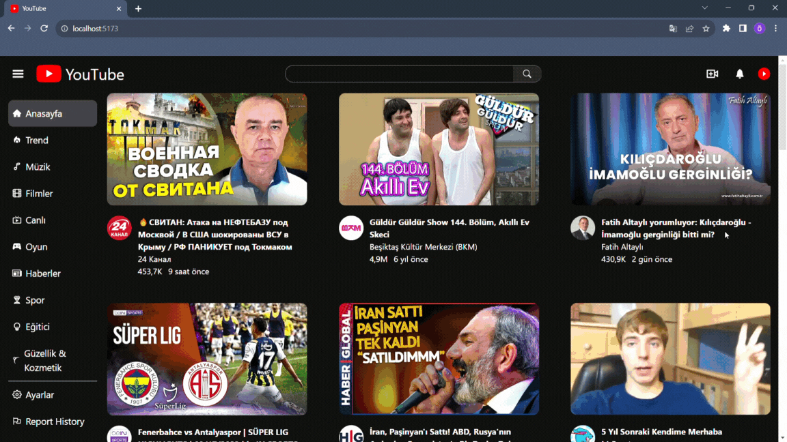

# YouTube-Clone

- Bu projede React.js kullanılarak geliştirildi.

- Youtube da olduğu gibi açılır kapanır menü yapıldı.

- Kategori bilgileri context yapısında tutuldu.

- Seçilen kategoriye göre o kategori ile ilgili videolar ekrana aktarıldı.

- Video detay sayfası yapıldı.

## Kütüphaneler

- react-router-dom

- axios

- react-icons

- millify

- moment

- react-player

- tailwind

## Kaynaklar

- https://rapidapi.com/Glavier/api/youtube138/

## Gif

